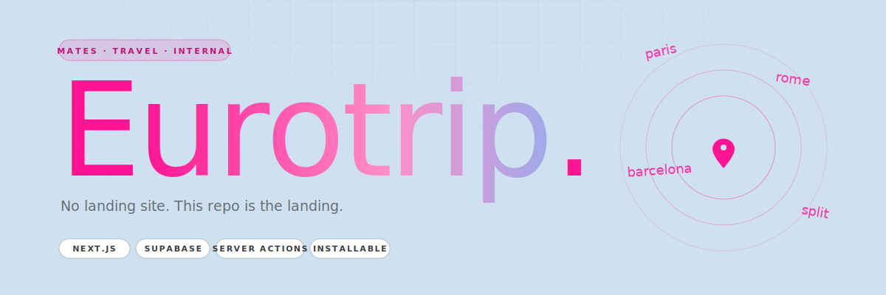

<div align="center">
  
</div>

<p align="center">
  
  
  
  
  
</p>

<br/>

> **Eurotrip** is a private itinerary platform I built for a twenty-person family trip through Europe. Mum had the whole thing mapped out in Excel; everyone in the family kept messaging her for flight details and hotel names. So I turned the spreadsheet into an app — login-gated, personal per user, and all six cities deep.
>
> **This was my first user platform.**

<br/>

## The story

Twenty of us. One month. Six cities. The itinerary lived in a spreadsheet, and the spreadsheet lived in Mum's head.

Every day she fielded the same questions: *when are we in Athens again?*, *what's the name of the hotel in Cannes?*, *can you send me my flight reference?* — twenty times over, across months, in WhatsApp chats that rolled out of reach. So I rebuilt the whole thing as a web app that everyone in the family could log into and pull their own answers out of.

It worked. It ran through the entire trip. It built more hype than any group chat ever could.

<br/>

## The route

```
Athens  ─→  Paros  ─→  Cannes + Côte d'Azur  ─→  Sorrento + Amalfi  ─→  Rome  ─→  London
```

Internal flights between countries, trains across borders, transfers booked to the hour, a lot of accommodation, and restaurant reservations anchored to birthdays and special nights along the way.

<br/>

## What was in the app

| | |
|---|---|
| **Personal travel docs** | Every user saw their own flight tickets, accommodation booking references, transfers and train reservations. No "can someone forward me the email" — the email was the app. |
| **Shared activity feed** | A day-by-day list of things planned for each city, with **voting** so the twenty of us could land on what to do without making Mum hold a committee meeting on a bus. |
| **Nearby-this-city** | Gyms, coffee shops, and shopping pinned per stop. Because the person who trains on holiday and the person who needs a flat white at 7am both exist and both deserve a clean answer. |
| **Restaurants & events** | Birthday dinners and pre-booked restaurants anchored to the day they happened. Everyone knew where and when, well before we got there. |
| **Login-gated** | No public signup — one row in the `users` table per family member. If you weren't on the trip, you weren't in the app. |
| **Installable as a PWA** | Full web app manifest, offline-friendly, sat on our phones like a native app. Reception in rural Greece and the Amalfi coast was… aspirational. |

<br/>

## Stack

| Layer | Tech |
|---|---|
| Framework | **Next.js** · App Router · TypeScript |
| Rendering | Server Components + Server Actions (`actions/itinerary.ts`) |
| DB / Auth / Storage | **Supabase** — rows for itinerary, activities, bookings, users · storage for background media |
| UI | **shadcn/ui** · Radix · Tailwind |
| PWA | Web App Manifest (`app/manifest.ts`) · installable on iOS + Android |
| Middleware | Session-aware edge middleware via `@supabase/auth-helpers-nextjs` |
| Landing | `/` renders a public `<Landing />` for logged-out visitors, the actual itinerary for signed-in users |

<br/>

## Project layout

```
eurotrip/
├── app/
│   ├── page.tsx                       Server component — auth gate, renders landing OR itinerary
│   ├── itinerary-client-wrapper.tsx   Client boundary for the main itinerary
│   ├── login/                         Auth form
│   ├── suggested-activities/          Per-city shortlist view
│   └── manifest.ts                    PWA manifest
├── actions/
│   └── itinerary.ts                   Server actions — mutate the trip state
├── components/
│   ├── marketing/
│   │   ├── landing.tsx                Public landing page (pink / pale blue)
│   │   └── landing.module.css
│   └── …
├── middleware.ts                      Session refresh at the edge
└── lib/
    └── supabase-client.ts             Server + browser Supabase factories
```

<br/>

## Running locally

```bash
pnpm install
cp .env.local.example .env.local

# Env vars
#   NEXT_PUBLIC_SUPABASE_URL
#   NEXT_PUBLIC_SUPABASE_ANON_KEY
#   SUPABASE_SERVICE_ROLE_KEY    (server-only)

pnpm dev
```

<br/>

## License

No license granted. Source visible as a portfolio artefact. **All rights reserved.** If you stumble across real itinerary data in history, this was 2025 — we're home.

<br/>

---

<p align="center">
  <sub>Built by <a href="https://github.com/KezLahd">Kieran Jackson</a> · For the family · Another <a href="https://instagram.com/kieranjxn">Kez Curation ↗</a></sub>
</p>
